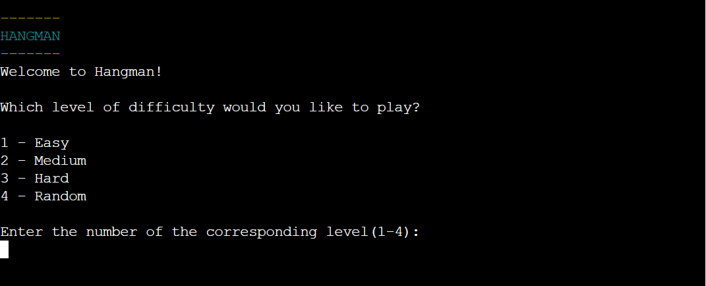

# Hangman

The aim of this project was to create a fun and thought-provoking Python terminal hangman game.


## How to Play

- The user selects the difficulty level of the game, which is either easy, medium or hard.
- The user inputs a letter that they think is apart of the word they are trying to guess.
- The game is won if the user guesses all the letters in the word.
- The game is lost if the user runs out of lives before they could guess all the letter in the word.

## Table of contents
- [UX](#ux)
  - [Application Purpose](#application-purpose)
  - [Application Goals](#application-goals)
  - [Audience](#audience)
  - [Communication](#communication)

- [Design](#design)
  - [Wireframes](#wireframes)

- [Features](#features)
  - [Existing Features](#existing-features)
  - [Future Features](#future-features)

- [Data Model](#data-model)

- [Testing](#testing)
  - [Validator Testing](#validator-testing)
  - [Solved Bugs](#solved-bugs)

- [Programs and Libraries Used](#programs-and-libraries-used)

- [Deployment](#deployment)

- [Credits](#credits)

## UX

### Application Purpose
To allow users to be entertained and challenged by guessing an unknown word with a limited amount of guesses.

### Application Goals
To expand users vocabulary and to provide a fun learning experience for all.

### Audience
As the game depicts an image of the hangman being hung when the game has been lost, the target audience is 16 years and over.

### Communication
- As the purpose of the game is to provide an entertaining yet challenging experience, I have intuitively designed the game so the user can easily work their way through the game from start to finish, with an option to restart the game at the end so the users main focus is only guessing the word.
- As it is a terminal game, I have added colour to certain words and sentances to provide a bit more excitement. All colours used have good contrast against the black background.

## Design
### Wireframes

Before I wrote any code, I planned the design of the game through the use of a flow chart as shown below, to help me visualise what I needed to build.


## Features
### Existing Features
#### Introduction and Select Level of Difficulty Section:
The game title and levels of difficulty are the first things the user are presented with. The game title is coloured to make it stand out so the user is reminded of the game they are playing and to add an element of fun. Next, the user can pick the difficulty level they would like to play, or they can select random which will choose a random level for the user. The execution of each line is suspended for 1 second using the sleep() function from the imported time module, to allow time for the user to read the text and to create flow instead of all text appearing at once.



#### Number of Lives Section:
Once the user has chosen the level of difficulty they would like to play, the number of lives they have are revealed.
- Easy level: 6 lives
- Medium level: 5 lives
- Hard level: 4 lives


#### Main Game Play Section:

In this section there are a number of different features, which are outlined below.

- Clear the terminal: The terminal is initially cleared to make it clear that this is the main game section and to make the game less cluttered. 

- User input: The user is asked to input a letter they think could be in the word. If they make an incorrect guess, like in the example below, they will lose a life and the hangman image will reflect this by showing the first piece of the hangman.


- User input: However, if the user guesses a correct letter, the dash is replaced with the guess and the number of lives and hangman image stays the same.


- Error message: An error message will appear if the user enters anything other than an lower case letter for their guess.


- You lost message: When the user has ran out of lives, the full hangman image is revealed and a "You lost" message is shown. The message is coloured red to further symbolise that the game has been lost.


- You won message: A "You won!" message is displayed to signal that the user has guessed the word correctly and therefore won the game. The message is coloured green to further symbolise that they have won the game.


- Play again feature: When the user either wins or loses the game, the play again feature is displayed. This feature makes the game play more efficient for the user, becuase if they want to play the game again they don't have to restart it manually, they can simply type in "y". If "n" is entered, the game will stop. If any other input apart from "y" or "n" is entered, then a message will display telling the user to input either "y" or "n". The message is coloured yellow to make it clear that they have entered an invalid input.


#### Other features:
- Hangman images: The hangman images as shown in the above features were included to make the game more visually appealing for the user. All the images used for each difficulty level are stored in the hangman_images file in static methods respectively, within a HangmanImages class. I chose to place these images in a seperate file to keep in line with the seperation of concerns principle and keeping the code readable and reusuable.

- Words list: Instead of making a list of words within the hangman file, I placed all words into a Google spreadsheet and used the Google Sheets API to retrieve the relevant words. This helped me keep my code clean and allowed me to learn how to integrate and use the Google Sheets API.


### Future Features
- Allow the user to add their own words which will update the Google spreadsheet accordingly.
- Add a highscore system which can create competition between users.

## Data Model

I have used a Hangman class to store all the game variables needed such as the level of difficulty, the number of lives, the chosen word, the chosen word but hidden with dashes and the hangman images. The Hangman class contains all the methods needed to run the game. I have stored this in a file named hangman.

I have used a second class in my hangman_images file named HangmanImages. This class contains three static methods, one for each level of difficulty (easy, medium and hard), which each hold a list of hangman images to be displayed each time a user loses a life. I imported this hangman_images class into my hangman file to be able to access the lists and iterate through them to access each hangman image.

In my run file, I have imported the Hangman class and created an instance of the Hangman class. I also call the run_game() method in this file. Running this file will commence the game.

## Testing
### Validator Testing
All three Python files were tested using the CI Python Linter. No errors were raised:

hangman.py:


hangman_images.py:


run.py:


### Manual Testing
I have tested all possible outcomes of the game. This has been done by:

- Entering invalid input each time input is requested. An appropriate error message is displayed to inform the user of their actions.
- All hangman images display correctly according to the number of lives left.
- The number of lives decreases correctly for each life lost.

### Solved Bugs
When testing my game after I had created all the methods to run the whole program, I had a reccuring error message that would appear only when the user guessed a correct letter on the first try:

```
"IndexError: list index out of range"
``` 
The origin of this error was the three lists in my hangman_images file that hold the easy, medium and hard hangman images to be displayed after each life is lost during game play. For the easy, medium and hard difficulty levels, the user has 6, 5 and 4 lives repectively. Within each hangman images list, I placed the same number of images as the number of lives and used the below code to access each image based on the number of lives the user had:

```
print(self.hangman_images[self.number_of_lives])
```
After consulting with Oisin from tutor support service, he reminded me that list indexing starts from 0. This made me realise what the issue was. When the player has 0 lives left, the full hangman image is shown, so when the user guessed a letter correctly on their first attempt, the code was trying to access the list item at index 6, however, the list only went up to index 5 so it was trying to access a list item at an index that didn't exist, causing the error.

To resolve this, I simply added another hangman image to each hangman images list, so each list for the easy, medium and hard difficulty levels now has 7, 6 and 5 images repectively, to display for each life lost.

## Programs and Libraries Used
- [GitHub](https://github.com/) - Used to store the project repository.
- [GitPod](https://gitpod.io/) - Cloud development environment used to create my Python files.
- [Heroku](https://www.heroku.com/) - Cloud platform used to deploy my project.
- [Google Sheets](https://docs.google.com/spreadsheets/u/0/) - Used to store the all the words in the game.
- [TinyPNG](https://tinypng.com/) - Used to compress all .png files.
- [Am I Responsive?](https://ui.dev/amiresponsive) - Used to reveal how the game looks in the mock terminal on different devices.
- [Lucidchart](https://www.lucidchart.com/pages/) - Used to create a flow chart to plan the design of the game.

## Deployment
This project was deployed using Heroku. The steps taken to deploy this project are outlined below:

#### Preparing for deployment:
1. Add a new line character ("\n") at the end of each input request.
2. Create a list of dependancies to go into the requirements.txt file by typing "pip3 freeze > requirements.txt" into the terminal.

#### Deployment:
1. Log into Heroku and in the dashboard, press the "Create new app" button.
2. Click on the "Settings" tab, scroll down to the "Reveal Config Vars" button and click on it to create config vars.
3. Add the first config vars. The key is "CREDS" and value is the contents of the creds.json file.
4. Add the second config vars. The key is "PORT" and value is "8000".
5. Click on the "Add buildpack" button on the same page and add the buildpacks "python" and "node.js" in this order.
6. Click on the "Deploy" tab.
7. Choose the "GitHub" deployment method and then connect to GitHub.
8. Scroll down to the "Automatic deploys" section, select the "main" branch to deploy from and then press the "Enable Automatic Deploys" button to deploy the project.

The link to my live site can be found [here.](https://hman-project-3-800c1515cb29.herokuapp.com/)

## Credits
- I would like to give credit and a special thank you to [Jaspreet](https://github.com/JaspreetSAujla), for being there for me throughout my project and for introducing me to static methods, which I then decided to implement in my code. Credit is given accordingly in the hangman_images file.

- I used this [article](https://stackoverflow.com/questions/735975/static-methods-in-python) from Stack Overflow to help consolidate my knowledge on static methods and to make sure I was implementing it right and accessing the data from the methods correctly.

- I would like to give credit and a special thank you to my Code Institute mentor Martina Terlevic, for providing support and guidance throughout my project.

- I would like to give credit and a special thank you to Oisin from the Code Institute tutor support service. He was very helpful and very professional in the way he helped me understand why I was recieving the IndexError, as mentioned in the solved bugs section above.

- I would like to give credit to fellow Code Institute student Tucker. The link to their GitHub repository from which I took inspiration from is linked [here.](https://github.com/TuckerFaulk/hangman-project) I specifically took inspiration from line 31 in their run.py file. Upon reading their code, I noticed how they imported the os module and then used the following line of code to clear the terminal, to which I took inspiration from in my own code. Credit has been given accordingly in my hangman file:

```
os.system('cls||clear')
```
- This [article](https://pypi.org/project/termcolor/) from PyPI helped me to install the termcolor library, so I could colour text in the terminal.

- I took inspiration from this [article](https://stackoverflow.com/questions/41752946/replacing-a-character-from-a-certain-index) from Stack Overflow, as I saw how they used the below line of code to replace a value for another value at a certain index. This gave me inspiration on how I could go about replacing the dash in the hidden word with a correct user input guess. I have given credit accordingly in my hangman file.

```
s = s[:index] + newstring + s[index + 1:]
```